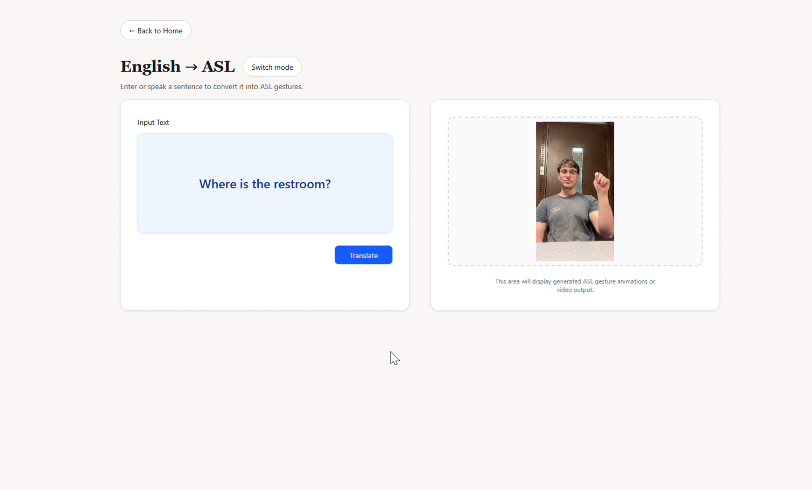
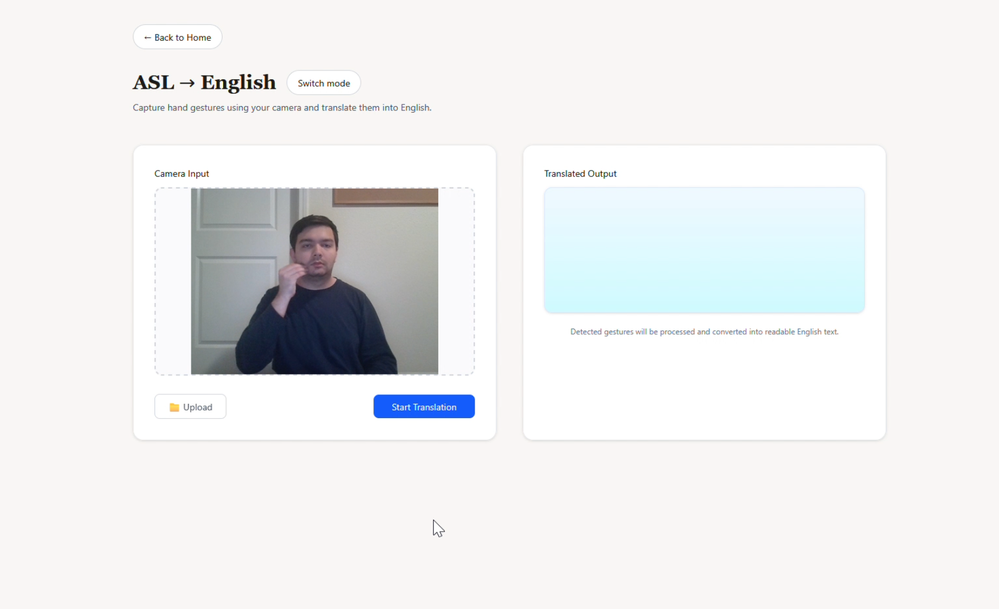
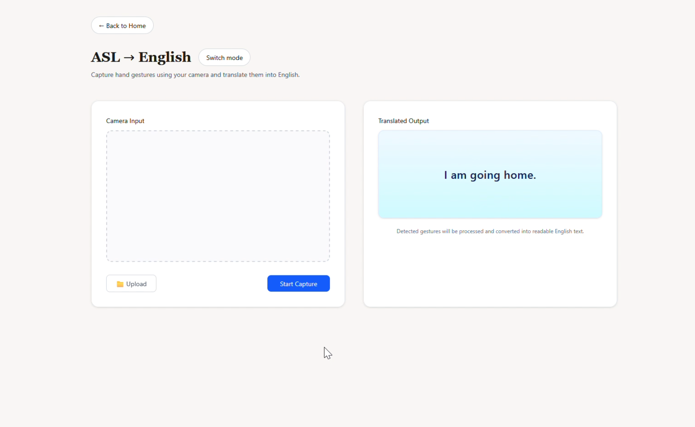
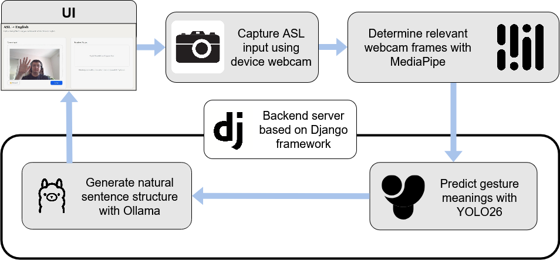
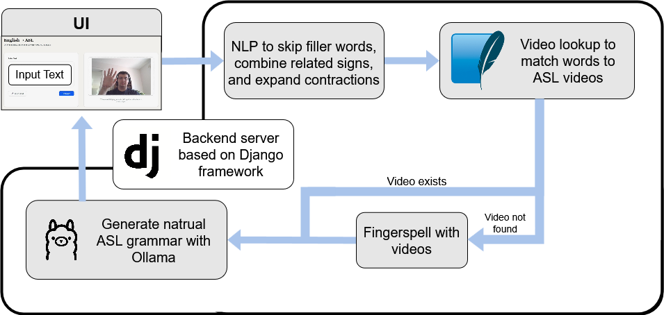

# ASL Translator

A bidirectional American Sign Language (ASL) and English translation prototype built with React, Django REST, MediaPipe, YOLO, SQLite, and Ollama.

The project supports two translation directions:

- ASL to English: webcam or uploaded ASL video input is processed in the React frontend with MediaPipe Hand Landmarker. The frontend selects key frames from the signing motion, sends them to the Django backend, and the backend uses a custom-trained YOLO model to recognize signs before Ollama converts the detected sign sequence into English text.
- English to ASL: typed English text is sent to the Django backend, cleaned into ASL-ready sign tokens, matched against a SQLite-backed ASL video database, and returned to the React frontend as an ordered video sequence. When a full word video is not available, the system falls back to fingerspelling using individual ASL letter videos.

## Demo Videos

Full demo videos are hosted externally so the repository stays lightweight.

- [ASL to English - Uploaded Video Demo](https://youtu.be/4DlhxzcDxMo)
- [ASL to English - Webcam Capture Demo](https://youtu.be/cDuMw-_7Uxw)
- [English to ASL - Word Videos Demo](https://youtu.be/_jp9AuPQU1A)
- [English to ASL - Fingerspelling Demo](https://youtu.be/AaG-NfvBmuI)

## Screenshots

### English to ASL



### ASL to English

The ASL-to-English flow uses the video area while capturing frames, then displays the translated sentence after processing.

| Capture input | Translation output |
| --- | --- |
|  |  |

## Features

- Webcam-based ASL input
- Uploaded ASL video input
- MediaPipe hand tracking to select useful frames
- YOLO-based ASL sign recognition
- Ollama-based sentence generation for ASL-to-English output
- English-to-ASL text cleanup and sign token matching
- ASL word video playback
- Fingerspelling fallback using ASL letter videos
- Local SQLite database for ASL video metadata
- Custom frame extraction and YOLO labeling tool for dataset creation

## Tech Stack

### Frontend

- React
- Vite
- Tailwind CSS
- React Router
- MediaPipe Tasks Vision

### Backend

- Django
- Django REST Framework
- SQLite
- Ultralytics YOLO
- Ollama
- Pillow

## How It Works

### ASL to English



1. The user signs through the webcam or uploads a video.
2. The React frontend uses MediaPipe Hand Landmarker to track hand movement.
3. The frontend saves only important frames instead of sending every video frame.
4. The selected frames are sent to the Django API at `/api/asl-to-english/`.
5. The backend loads the frames as images and runs the YOLO model.
6. The detected sign names are cleaned so repeated signs are not added many times in a row.
7. If more than one sign is detected, Ollama converts the sign sequence into a simple English sentence.
8. The translated English text is returned to the frontend and displayed to the user.

### English to ASL



1. The user enters English text in the frontend.
2. The text is sent to the Django API at `/api/english-to-asl/`.
3. The backend breaks the sentence into clean lowercase words.
4. Small filler words such as `the`, `a`, `an`, `to`, and `is` are removed.
5. Common words are normalized to match database tokens, such as `me` to `i` and `hi` to `hello`.
6. The backend searches the `ASLVideo` database for matching word videos.
7. If a full word video is missing, the backend falls back to fingerspelling with letter videos.
8. The frontend receives the video sequence and plays the ASL videos in order.

## Frame Extraction Tool

This repository includes `extract_frames_compact.html`, a browser-based tool used during dataset creation.

The tool helps turn raw sign videos into YOLO training data. A user can upload a video, step through it frame by frame, save useful frames, and automatically generate YOLO label files using MediaPipe hand detection.

Main functions:

- Upload a local sign video.
- Move frame by frame with the arrow keys.
- Press Space or click a button to save the current frame.
- Detect hands with MediaPipe.
- Draw bounding boxes around detected hands.
- Enter the class name and class number for the sign.
- Download image files and matching YOLO `.txt` label files.
- Delete unwanted saved frames before downloading.

This made data collection faster because the team did not have to manually draw every bounding box from scratch. It also kept the output close to the YOLO training format used for the custom sign recognition model.

To use it, open `extract_frames_compact.html` directly in a browser and select a local video file.

## Project Structure

```text
ASL-Translator/
|-- ASL_backend/
|   |-- api/
|   |   |-- management/
|   |   |   `-- commands/
|   |   |       `-- sync_asl_videos.py
|   |   |-- migrations/
|   |   |-- views/
|   |   |   |-- asl_to_english.py
|   |   |   |-- english_to_asl.py
|   |   |   |-- health.py
|   |   |   `-- __init__.py
|   |   |-- yolo/
|   |   |   |-- 10-class-no-background.pt
|   |   |   |-- 20-class-background.pt
|   |   |   `-- 20-class-no-background.pt
|   |   |-- models.py
|   |   |-- services.py
|   |   |-- tests.py
|   |   `-- urls.py
|   |-- config/
|   |   |-- settings.py
|   |   `-- urls.py
|   |-- manage.py
|   `-- requirements.txt
|-- ASL_frontend/
|   |-- public/
|   |   |-- letters/
|   |   `-- words/
|   |-- src/
|   |   |-- pages/
|   |   |   |-- Asl_English.jsx
|   |   |   |-- English_Asl.jsx
|   |   |   `-- HomePage.jsx
|   |   |-- App.jsx
|   |   |-- main.jsx
|   |   `-- routes.jsx
|   |-- package.json
|   `-- vite.config.js
|-- images/
|   |-- asl-english1.png
|   |-- asl-english2.png
|   `-- english-asl.png
|-- extract_frames_compact.html
`-- README.md
```

## API Endpoints

| Method | Endpoint | Description |
| --- | --- | --- |
| GET | `/api/health/` | Confirms the backend is running |
| POST | `/api/asl-to-english/` | Accepts selected ASL image frames and returns English text |
| POST | `/api/english-to-asl/` | Accepts English text and returns an ASL video sequence |

## Local Setup

### Requirements

- Node.js
- Python 3.11.x
- Git
- Ollama

### 1. Clone the repository

```powershell
git clone <repo-url>
cd ASL-Translator
```

### 2. Install the Ollama model

The ASL-to-English sentence generation uses a local Ollama model.

```powershell
ollama run llama3.2:3b
```

Keep Ollama running while using the ASL-to-English translation flow.

### 3. Start the frontend

```powershell
cd ASL_frontend
npm install
npm run dev
```

Frontend URL:

```text
http://localhost:5173
```

### 4. Start the backend

Open another terminal:

```powershell
cd ASL_backend
python -m venv venv
.\venv\Scripts\Activate.ps1
pip install -r requirements.txt
python manage.py migrate
python manage.py sync_asl_videos
python manage.py runserver
```

Backend URL:

```text
http://127.0.0.1:8000
```

Health check:

```text
http://127.0.0.1:8000/api/health/
```

## ASL Video Database

The English-to-ASL feature uses videos stored in:

```text
ASL_frontend/public/words/
ASL_frontend/public/letters/
```

The backend stores the available video paths in the `ASLVideo` table. After adding or changing videos, run:

```powershell
cd ASL_backend
.\venv\Scripts\python.exe manage.py sync_asl_videos
```

Current video coverage includes common words such as `hello`, `help`, `water`, `want`, `you`, `yes`, `no`, `where`, and all alphabet letters for fingerspelling.

## Development Commands

Frontend:

```powershell
cd ASL_frontend
npm run dev
npm run lint
npm run build
```

Backend:

```powershell
cd ASL_backend
.\venv\Scripts\Activate.ps1
python manage.py runserver
python manage.py test
```

## Notes

- The backend uses SQLite for local development.
- Do not commit `ASL_backend/venv/`, `.env`, or `db.sqlite3`.
- Large demo videos are intentionally hosted outside the repository.
- The YOLO model currently supports a limited vocabulary, so translation quality depends on the available trained sign classes.
- English-to-ASL output depends on videos available in `public/words` and `public/letters`.

## Contributors

- Daniel
- Juhair
- Abrar
- Mikkal
- Parth
